# Enhanced QR Code Scanner System

## Overview

The QR code scanner has been comprehensively updated to properly verify and validate the latest QR codes generated by the system. This document outlines the enhancements and new features.

## 🚀 Key Enhancements

### 1. **Enhanced Validation Logic**
- **Comprehensive Error Handling**: 12 distinct error codes with user-friendly messages
- **Organizer Permission Validation**: Ensures organizers can only scan tickets for their events
- **Payment Status Verification**: Validates payment completion before allowing check-in
- **Event Date Validation**: Prevents check-in for events outside the valid window
- **Race Condition Protection**: Atomic updates to prevent duplicate check-ins

### 2. **Improved Security**
- **Data Integrity Checks**: Enhanced checksum validation
- **Encryption Compatibility**: Works with latest AES-256-CBC encryption
- **Permission-based Access**: Organizer-scoped validation
- **Audit Logging**: Comprehensive logging of all scan attempts

### 3. **Better User Experience**
- **Real-time Feedback**: Immediate validation results with detailed error messages
- **Two-step Process**: Validate first, then confirm check-in
- **Visual Error Indicators**: Color-coded results with icons and descriptions
- **Scan History**: Track recent scan attempts with timestamps

## 🔧 Technical Implementation

### Error Codes and Handling

| Error Code | Description | User Message |
|------------|-------------|--------------|
| `INVALID_INPUT` | Invalid QR code format | "The QR code format is not recognized" |
| `DECRYPTION_FAILED` | Cannot decrypt QR data | "Unable to decrypt QR code data" |
| `TICKET_NOT_FOUND` | Ticket doesn't exist | "This ticket does not exist in our system" |
| `DATA_MISMATCH` | QR data doesn't match ticket | "The QR code data doesn't match the ticket" |
| `PERMISSION_DENIED` | Organizer lacks permission | "You don't have permission to validate this ticket" |
| `PAYMENT_NOT_VERIFIED` | Payment not completed | "Payment for this ticket has not been verified" |
| `TICKET_INACTIVE` | Ticket is cancelled/inactive | "This ticket has been cancelled or is no longer active" |
| `QR_EXPIRED` | QR code has expired | "This QR code has expired and can no longer be used" |
| `QR_ALREADY_USED` | QR code already used | "This QR code has already been used for check-in" |
| `ALREADY_CHECKED_IN` | Ticket already checked in | "This ticket has already been checked in" |
| `EVENT_EXPIRED` | Event check-in window closed | "The check-in window for this event has closed" |
| `SYSTEM_ERROR` | Technical error | "A technical error occurred" |

### Validation Flow

```mermaid
graph TD
    A[Scan QR Code] --> B[Decrypt Data]
    B --> C{Valid Format?}
    C -->|No| D[DECRYPTION_FAILED]
    C -->|Yes| E[Find Ticket in DB]
    E --> F{Ticket Exists?}
    F -->|No| G[TICKET_NOT_FOUND]
    F -->|Yes| H[Verify Data Match]
    H --> I{Data Matches?}
    I -->|No| J[DATA_MISMATCH]
    I -->|Yes| K[Check Permissions]
    K --> L{Has Permission?}
    L -->|No| M[PERMISSION_DENIED]
    L -->|Yes| N[Validate Payment]
    N --> O{Payment OK?}
    O -->|No| P[PAYMENT_NOT_VERIFIED]
    O -->|Yes| Q[Check Ticket Status]
    Q --> R{Active?}
    R -->|No| S[TICKET_INACTIVE]
    R -->|Yes| T[Check Already Checked In]
    T --> U{Checked In?}
    U -->|Yes| V[ALREADY_CHECKED_IN]
    U -->|No| W[✅ VALID]
```



### API Endpoints

#### Validation Endpoint
```typescript
POST /api/organizer/[id]/qr-code/validate
{
  "qrCodeData": "encrypted_qr_string",
  "checkIn": false // true for check-in, false for validation only
}
```

#### Response Format
```typescript
{
  "success": boolean,
  "message": string,
  "error"?: string,
  "errorCode"?: string,
  "data"?: {
    "ticket": {
      "id": string,
      "checkedIn": boolean,
      "checkInTime"?: string,
      "event": { "title": string, "startDate": string, "venue": string },
      "ticketType": { "name": string, "price": number },
      "holder": { "fullName": string, "email": string },
      "transaction": { "invoiceNumber": string, "status": string }
    }
  }
}
```

## 🧪 Testing

### Test Endpoints

1. **QR Scanner Validation Test**
   ```
   GET /api/test/qr-scanner-validation
   ```
   - Tests validation with real ticket data
   - Verifies error scenarios
   - Validates complete flow

2. **QR Compatibility Test**
   ```
   GET /api/test/qr-compatibility
   ```
   - Tests QR generation/validation compatibility
   - Checks encryption/decryption integrity
   - Validates image generation

3. **Manual QR Test**
   ```
   POST /api/test/qr-scanner-validation
   {
     "encryptedData": "qr_code_string",
     "organizerId": "organizer_id",
     "testCheckIn": true
   }
   ```

### Running Tests

```bash
# Test QR scanner validation
curl http://localhost:3000/api/test/qr-scanner-validation

# Test QR compatibility
curl http://localhost:3000/api/test/qr-compatibility

# Test specific QR code
curl -X POST http://localhost:3000/api/test/qr-scanner-validation \
  -H "Content-Type: application/json" \
  -d '{"encryptedData":"your_qr_data","organizerId":"org_id"}'
```

## 🔍 Audit Logging

All scan attempts are logged with:
- **Attempt ID**: Unique identifier for each scan
- **Timestamp**: When the scan occurred
- **Organizer ID**: Who performed the scan
- **Ticket ID**: Which ticket was scanned
- **Action**: Type of action (validation, check-in, error)
- **Result**: Success/failure with error details
- **Metadata**: Additional context (processing time, attendee info)

Example log entry:
```
📋 AUDIT LOG: CHECK_IN_SUCCESS {
  attemptId: "checkin_1703123456789_abc123def",
  ticketId: "ticket_xyz789",
  organizerId: "org_123",
  eventId: "event_456",
  timestamp: "2024-12-21T10:30:00.000Z",
  metadata: {
    attendeeName: "John Doe",
    ticketType: "VIP",
    processingTimeMs: 245
  }
}
```

## 🛡️ Security Features

1. **Encryption**: AES-256-CBC encryption for QR data
2. **Checksum Validation**: SHA-256 checksums for data integrity
3. **Permission Checks**: Organizer-scoped access control
4. **Expiration Handling**: Time-based QR code expiration
5. **Race Condition Protection**: Atomic database updates
6. **Audit Trail**: Complete logging of all activities

## 🎯 Usage Instructions

### For Organizers

1. **Access Scanner**: Navigate to your event dashboard and click "QR Scanner"
2. **Choose Mode**: Select camera or manual input mode
3. **Scan QR Code**: Point camera at QR code or paste data manually
4. **Review Details**: Check ticket information displayed
5. **Confirm Check-in**: Click "Confirm Check-in" to complete the process

### Camera Scanner
- Requires HTTPS for camera access
- Automatically detects and scans QR codes
- Prevents duplicate scans within 2 seconds
- Supports multiple camera devices

### Manual Scanner
- Paste QR code data directly
- Useful for troubleshooting
- Supports keyboard shortcuts (Ctrl+Enter)
- Handles large QR data strings

## 🔧 Troubleshooting

### Common Issues

1. **Camera Not Working**
   - Ensure HTTPS is enabled
   - Check browser camera permissions
   - Try different camera devices
   - Refresh the page

2. **QR Code Not Recognized**
   - Ensure QR code is from the current system
   - Check if QR code is damaged or corrupted
   - Try manual input mode
   - Verify QR code hasn't expired

3. **Permission Denied**
   - Verify you're the event organizer
   - Check if ticket belongs to your event
   - Ensure you're logged in correctly

4. **Already Checked In**
   - QR codes can only be used once
   - Check scan history for previous check-in
   - Contact support if needed

### Error Resolution

- **DECRYPTION_FAILED**: QR code may be from old system or corrupted
- **TICKET_NOT_FOUND**: QR code may be fake or from different system
- **PAYMENT_NOT_VERIFIED**: Wait for payment confirmation
- **EVENT_EXPIRED**: Check-in window may have closed

## 📊 Performance

- **Validation Time**: < 500ms average
- **Camera Scan Rate**: 1 scan per 2 seconds (prevents duplicates)
- **Error Detection**: Immediate feedback
- **Database Queries**: Optimized with proper includes
- **Memory Usage**: Minimal with efficient data structures

## 🔄 Compatibility

- **QR Code Formats**: All current system-generated QR codes
- **Browsers**: Chrome, Firefox, Safari, Edge (latest versions)
- **Devices**: Desktop, tablet, mobile with camera support
- **Network**: Works offline after initial load (validation requires network)

## 📈 Monitoring

Monitor these metrics for system health:
- Scan success rate
- Average validation time
- Error distribution by type
- Check-in completion rate
- Camera initialization success rate

The enhanced QR scanner provides a robust, secure, and user-friendly solution for ticket validation and check-in processes.
